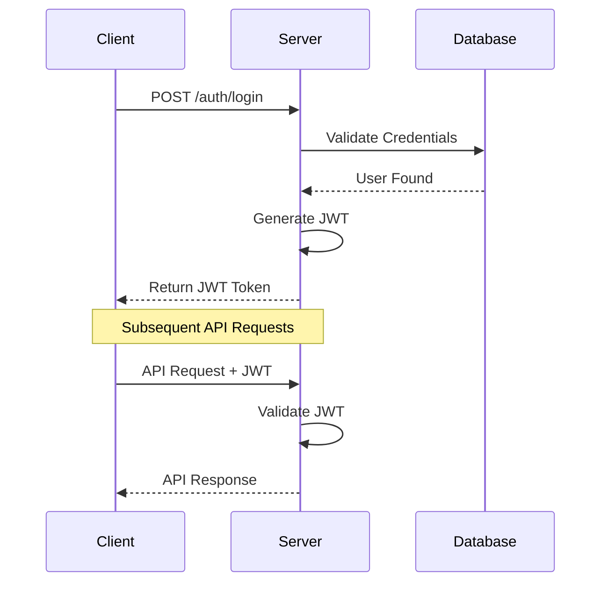

import CodeSamples from '@site/src/components/CodeSamples';

# Authentication Overview

Terrarium uses JSON Web Tokens (JWT) for API authentication. This guide will walk you through the authentication process and best practices.

## Authentication Flow

1. **User Registration/Login**

   - User provides credentials
   - Server validates credentials
   - Server generates JWT token
   - Client stores token securely

2. **API Requests**
   - Client includes token in Authorization header
   - Server validates token
   - Server processes request if token is valid



## Token Types

### Access Token

- Short-lived (1 hour)
- Used for API requests
- Contains user permissions

### Refresh Token

- Long-lived (30 days)
- Used to get new access tokens
- Stored securely in HTTP-only cookies

## Getting Started

### 1. Register a New Account

<CodeSamples
endpoint="/auth/register"
method="post"
headers={{
    "Content-Type": "application/json"
  }}
params={{
    "email": "user@example.com",
    "password": "your-secure-password",
    "name": "John Doe"
  }}
/>

### 2. Login to Get Tokens

<CodeSamples
endpoint="/auth/login"
method="post"
headers={{
    "Content-Type": "application/json"
  }}
params={{
    "email": "user@example.com",
    "password": "your-secure-password"
  }}
/>

### 3. Use Token in API Requests

<CodeSamples
endpoint="/communities"
method="get"
headers={{
    "Authorization": "Bearer YOUR_ACCESS_TOKEN",
    "Content-Type": "application/json"
  }}
/>

## Security Best Practices

### 1. Token Storage

- Store access tokens in memory
- Store refresh tokens in HTTP-only cookies
- Never store tokens in localStorage or sessionStorage

```javascript
// ❌ Bad - Don't store in localStorage
localStorage.setItem('token', 'your-token');

// ✅ Good - Store in memory
let token = 'your-token';
```

### 2. Token Refresh

- Implement automatic token refresh
- Handle refresh token rotation
- Clear tokens on logout

```javascript
async function refreshToken() {
  const response = await fetch('/auth/refresh', {
    method: 'POST',
    credentials: 'include', // Important for cookies
  });

  if (response.ok) {
    const { accessToken } = await response.json();
    return accessToken;
  }

  throw new Error('Refresh failed');
}
```

### 3. Error Handling

- Handle 401 errors properly
- Implement retry with refresh
- Redirect to login when needed

```javascript
async function handleApiError(error) {
  if (error.status === 401) {
    try {
      const newToken = await refreshToken();
      // Retry original request with new token
    } catch (refreshError) {
      // Redirect to login
      window.location.href = '/login';
    }
  }
}
```

## Common Issues

### Token Expiration

If you receive a 401 error, your token might have expired. Use the refresh token endpoint to get a new access token:

<CodeSamples
endpoint="/auth/refresh"
method="post"
headers={{
    "Content-Type": "application/json"
  }}
/>

### Invalid Tokens

Make sure you're including the token correctly in the Authorization header:

```
Authorization: Bearer your-token-here
```

### CORS Issues

For browser-based applications, ensure your server is configured to accept requests from your domain and handle preflight requests properly.
