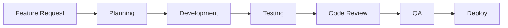

# Development Workflows

This directory contains documentation for development workflows and processes.

## Workflows

1. [Git Workflow](./git.md)
2. [Code Review Process](./code-review.md)
3. [Deployment Process](./deployment.md)
4. [Testing Workflow](./testing.md)
5. [Release Process](./release.md)

## Development Cycle

### 1. Feature Development

### 2. Code Review Checklist

- [ ] Follows coding standards
- [ ] Tests included
- [ ] Documentation updated
- [ ] Performance considered
- [ ] Security reviewed

### 3. Release Checklist

- [ ] Version bumped
- [ ] Changelog updated
- [ ] Tests passing
- [ ] Documentation current
- [ ] Dependencies updated
